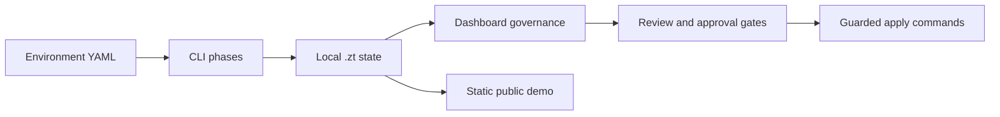

# Nutanix Kubernetes Platform ZeroTouch Framework

A clickable MVP prototype for a Nutanix Kubernetes Platform (NKP) ZeroTouch deployment framework.

Nutanix Kubernetes Platform ZeroTouch Framework shows how platform and infrastructure teams could validate, prepare, generate, govern, and review NKP deployment runs across connected, proxied, and air-gapped environments from one controlled operations portal.

The framework is designed so `air-gapped` is one supported deployment mode, not the only mode.

Current release: `v0.1.0`

Live demo: https://virtuarchitect.github.io/nkp-zerotouch-framework/

## Current Scope

| Area | Status | Notes |
| --- | --- | --- |
| Live demo | Simulated | GitHub Pages prototype for reviewing console workflows. It does not provision infrastructure. |
| Local CLI phases | Implemented baseline | Validation, prepare, generate, registry, deploy, verify, backup, upgrade, destroy, and run capture are available through `scripts/zt.*`. |
| Local dashboard | Implemented baseline | The console reads local `.zt` state, creates safe jobs, gates apply jobs, and records approvals/audit events. |
| Live infrastructure apply | Guarded | Apply-class actions require explicit flags, approvals, real NKP bundle paths, Prism Central details, registry access, and operator review. |
| Enterprise integrations | Probed baseline | Postgres, Vault, OIDC, and session-store settings can be modeled and health-checked; full production integration depends on local configuration. |

## Disclaimer

This repository is an independent clickable MVP prototype and community automation framework. All Nutanix integrations, provisioning jobs, policy checks, environment states, and admin workflows shown in the live demo are simulated for demonstration purposes only. The live demo does not provision real Nutanix infrastructure. This project is not affiliated with, sponsored by, or endorsed by Nutanix unless explicitly stated otherwise.

## How The Framework Works

The framework is organized around a plan-first deployment flow:

1. Define an environment in `configs/environments/*.yaml`.
2. Validate the environment schema, mode-specific settings, bundles, tools, and reachable endpoints.
3. Prepare a local `.zt/environments/<name>/` workspace for generated state and staged binaries.
4. Generate reviewable artifacts such as `cluster-values.yaml`, `nkp.env`, `deploy.sh`, and plan metadata.
5. Review plans in the dashboard, record approvals, and keep apply-class actions gated.
6. Run guarded `registry`, `deploy`, `upgrade`, or `destroy` apply commands only after explicit operator approval.
7. Verify cluster evidence, capture kubeconfig state, record runs, and keep backup/restore artifacts local.

The CLI is the execution surface. The dashboard is the local operations and governance surface. The static live demo is a visual prototype of that console.



The public demo mirrors the dashboard experience only; it does not read local `.zt` state or run apply commands.

## Engineering Quality

This project follows a production-grade quality bar. Changes are expected to
include relevant tests, smoke-test evidence, and security review when sensitive
code is touched. CI checks should pass before merge.

Quality gates include:

- Unit, integration, or end-to-end tests as appropriate.
- Linting and type checks where supported.
- Build verification.
- Manual or automated smoke testing for changed workflows.
- Security review for auth, user data, permissions, file handling,
  dependencies, and external input.

## Supported Environment Types

| Type | Use when | Artifact source |
| --- | --- | --- |
| `connected` | Deployment hosts can reach the internet and upstream registries. | Public registries and online repositories. |
| `proxied` | Deployment hosts reach external services through a corporate proxy. | Public registries through proxy settings. |
| `air-gapped` | Deployment hosts have no internet path. | Local NKP bundle, local registry, and mirrored artifacts. |

## NKP Bundle Types

| Bundle type | Example local path | Intended modes |
| --- | --- | --- |
| `standard` | `/mnt/c/Share/nkp-bundle_v2.17.1_linux_amd64/nkp-v2.17.1` | `connected`, `proxied` |
| `air-gapped` | `/mnt/c/Share/nkp-air-gapped-bundle_v2.17.1_linux_amd64/nkp-v2.17.1` | `air-gapped` |

## Repository Layout

```text
configs/
  environments/        # Example environment definitions
  schema/              # Config contract for validation and tooling
docs/                  # Design notes and runbooks
providers/             # Provider contracts and extension boundaries
scripts/               # ZeroTouch entrypoints
templates/             # NKP config templates by environment type
```

## Quick Start

1. Copy one of the examples from `configs/environments/`.
2. Edit cluster, Prism Central, registry, network, and deployment settings.
3. Validate the selected environment type:

```powershell
.\scripts\zt.ps1 validate -Config .\configs\environments\air-gapped.example.yaml
```

For Linux or WSL:

```bash
./scripts/zt.sh validate --config ./configs/environments/air-gapped.example.yaml
```

Validation discovers NKP bundle contents, checks mode-specific requirements, and reports pass/warn/fail results. See `docs/validation.md` for the current preflight checks.

Prepare a local workspace after validation succeeds:

```powershell
.\scripts\zt.ps1 prepare -Config .\configs\environments\air-gapped.example.yaml
```

See `docs/prepare.md` for workspace output and staged files.

The main phase sequence is:

```powershell
.\scripts\zt.ps1 validate -Config .\configs\environments\connected.example.yaml
.\scripts\zt.ps1 prepare  -Config .\configs\environments\connected.example.yaml
.\scripts\zt.ps1 generate -Config .\configs\environments\connected.example.yaml
.\scripts\zt.ps1 registry -Config .\configs\environments\connected.example.yaml
.\scripts\zt.ps1 deploy   -Config .\configs\environments\connected.example.yaml
.\scripts\zt.ps1 verify   -Config .\configs\environments\connected.example.yaml
```

See `docs/phases.md` for details.

Additional operational phases are available for secrets, backup, upgrade planning, guarded destroy planning, and CI smoke checks. See `docs/operations.md`.

## Documentation

- `docs/config-reference.md`
- `docs/runbook-connected.md`
- `docs/runbook-proxied.md`
- `docs/runbook-air-gapped.md`
- `docs/troubleshooting.md`
- `docs/public-readiness.md`
- `docs/implementation-status.md`
- `docs/roadmap.md`
- `docs/dashboard.md`
- `docs/architecture.md`
- `docs/architecture-review-checklist.md`
- `docs/architecture/data-flow.md`
- `docs/architecture/deployment-boundaries.md`
- `docs/restore-controls.md`
- `docs/container-runner.md`
- `docs/operational-readiness.md`
- `docs/enterprise-controls.md`
- `docs/production-persistence.md`
- `docs/lab-evidence-template.md`
- `docs/self-hosted-ci.md`
- `docs/upgrade-destroy-policy.md`

## Tests and Packaging

```powershell
.\tests\smoke.ps1 -Config .\configs\environments\connected.example.yaml
.\scripts\package.ps1 -Version dev
.\scripts\security-scan.ps1
python .\dashboard\app.py 8080
```

```bash
./tests/smoke.sh ./configs/environments/connected.example.yaml
./scripts/package.sh dev
./scripts/security-scan.sh
docker compose up --build dashboard
```

Open the containerized dashboard at `http://localhost:18080`.

## Versioning

The current framework version is stored in `VERSION`. Release notes live in `CHANGELOG.md`. Tag releases as `v<version>` to trigger the release packaging workflow.

## NKP Bundle Note

The NKP 2.17.1 bundles contain Linux AMD64 binaries. Run NKP deployment steps from Linux or WSL when using the bundled `nkp` and `kubectl` binaries.
