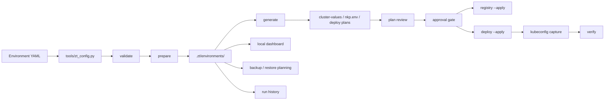

# Architecture

NKP ZeroTouch Framework is a local, plan-first automation framework for Nutanix Kubernetes Platform deployment workflows. It keeps real environment configuration, generated plans, run state, approvals, and audit evidence on the operator workstation or runner host.

The project has three user-facing surfaces:

- CLI scripts in `scripts/zt.ps1` and `scripts/zt.sh` execute validation, generation, guarded apply, verification, backup, and operational phases.
- The local dashboard in `dashboard/app.py` reads `.zt` state, starts safe jobs, gates apply jobs, records approvals, and exposes generated artifacts for review.
- The static live demo in `docs/demo/` mirrors the dashboard experience for public review without provisioning infrastructure.

## System Flow

## Runtime Surfaces

The CLI is the execution boundary. Safe phases such as `validate`, `prepare`, `generate`, `verify`, `backup`, and `runs` can be run directly or started from the dashboard. Apply-class phases such as `registry`, `deploy`, `upgrade`, and `destroy` remain guarded and require explicit apply flags.

The dashboard is the governance boundary. It presents environment readiness, plan review, approval policy, change records, locks, health checks, artifacts, backups, and run history from local state. Authenticated routes use local RBAC, POST forms use CSRF protection, and mutations are appended to the audit log.

The live demo is a documentation and review boundary. It is static HTML, CSS, and JavaScript. It shows the intended console workflow, but it does not call the CLI or provision NKP infrastructure.

## State Model

Repository files define desired intent and reusable contracts:

- `configs/environments/*.yaml` describes deployment targets.
- `configs/schema/environment.schema.json` defines the environment contract.
- `providers/` defines provider extension boundaries.
- `templates/` contains mode-specific generated configuration starting points.
- `docs/` records runbooks, policies, architecture, and operator guidance.

Generated state stays outside source control under `.zt/`:

- `.zt/environments/<name>/` contains prepared binaries, generated plans, reports, plan reviews, kubeconfig state, and backup metadata.
- `.zt/jobs/` contains dashboard job records and logs.
- `.zt/audit/events.jsonl` records local audit events.
- `.zt/runs/` contains execution summaries.

Real secrets stay local and are ignored by Git. Secret values are provided through local secrets files or environment variables and should not be committed.

## Control Model

The framework separates plan creation from infrastructure-changing execution:

- Validation checks configuration shape, mode-specific requirements, bundle paths, local tools, and selected endpoint reachability.
- Prepare creates the local workspace and stages the files required for later phases.
- Generate creates human-reviewable deployment artifacts.
- Plan review stores hashes so changed generated artifacts can make approvals stale.
- Apply-class commands require explicit operator flags, release-channel policy, approval thresholds, and change records.
- Verification and backup produce evidence after a run.

This model is intentionally conservative: generated plans should be inspected before registry pushes, cluster deployment, upgrades, destroy actions, or restore operations.

## Extension Model

Environment type controls connected, proxied, and air-gapped behavior. Provider directories describe platform-specific assumptions and future implementation boundaries. Templates keep generated configuration separate from environment identity and local state.

New providers should document:

- Required environment fields.
- Supported runner modes.
- Bundle and registry expectations.
- Generated artifacts.
- Apply and rollback boundaries.
- Verification evidence.

## Related Docs

- `docs/phases.md` for CLI phase behavior.
- `docs/dashboard.md` for console workflows and governance controls.
- `docs/architecture/data-flow.md` for config, generated state, secrets, and artifact flow.
- `docs/architecture/deployment-boundaries.md` for host, container, and air-gapped execution boundaries.
- `docs/environment-types.md` for connected, proxied, and air-gapped modes.
- `docs/implementation-status.md` for implemented, partial, and future capabilities.
