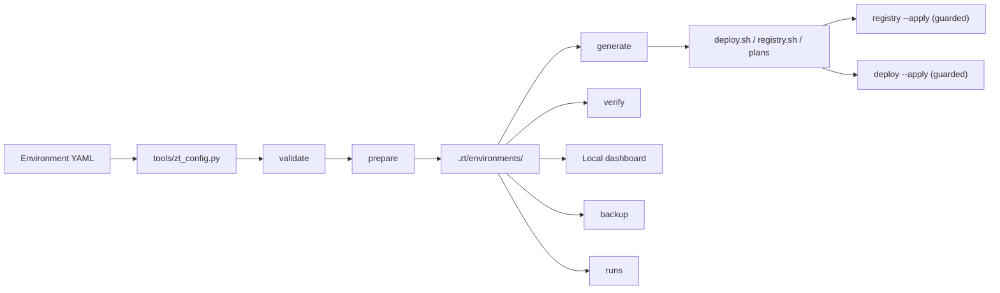

# Architecture

```mermaid
flowchart LR
  Config["Environment YAML"] --> Parser["tools/zt_config.py"]
  Parser --> Validate["validate"]
  Validate --> Prepare["prepare"]
  Prepare --> Workspace[".zt/environments/<name>"]
  Workspace --> Generate["generate"]
  Generate --> Plans["deploy.sh / registry.sh / plans"]
  Plans --> Registry["registry --apply (guarded)"]
  Plans --> Deploy["deploy --apply (guarded)"]
  Workspace --> Verify["verify"]
  Workspace --> Dashboard["Local dashboard"]
  Workspace --> Backup["backup"]
  Workspace --> Runs["runs"]
```

The repository tracks framework code, example configs, docs, tests, and packaging assets. Generated state and real secrets stay local under ignored paths.
