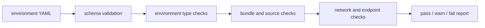
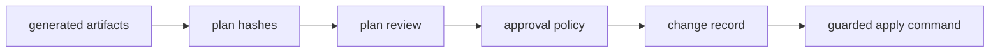

# Data Flow

This document describes how configuration, generated artifacts, secrets, approvals, and evidence move through the framework.

## Inputs

Environment YAML files under `configs/environments/` are the primary source of desired state. They define cluster identity, environment type, provider settings, bundle paths, registry settings, network values, and deployment intent.

The schema in `configs/schema/environment.schema.json` is the contract used by the CLI and dashboard to validate environment shape before later phases trust the data.

Provider contracts under `providers/` and templates under `templates/` define how generic environment intent becomes NKP-oriented generated artifacts.

## Validation Flow

Validation should be the first phase for every environment. It reports missing required fields, mismatched bundle type, invalid local paths, incomplete source metadata, duplicate identity values, and selected reachability findings.

## Generated State Flow

The `prepare` phase creates `.zt/environments/<name>/` and stages local workspace files. The `generate` phase then writes reviewable deployment artifacts, including:

- `cluster-values.yaml`
- `nkp.env`
- `deploy.sh`
- `deploy.ps1`
- `state/generate.json`

Later phases add registry plans, deploy plans, verification reports, backup manifests, restore plans, and kubeconfig state under the same environment workspace.

## Secrets Flow

Secrets are intentionally separate from committed config. Operators provide secrets through ignored local files or environment variables such as registry credentials. The framework may write redacted metadata under `.zt`, but secret values should never be committed.

Dashboard settings can model secret backends and integration endpoints. The dashboard should display presence, readiness, and health metadata rather than secret contents.

## Review And Approval Flow

Plan review stores approval records and hashes for generated artifacts. When generated plans change, old approvals can become stale. Apply-class jobs create change records and must satisfy approval policy before the operator runs guarded apply commands.

## Evidence Flow

Verification, backup, run capture, change records, job logs, and audit events provide evidence after operator action. The dashboard reads these local files and presents status without requiring a central service.

Generated evidence should stay local unless an operator intentionally exports it for lab review, change management, or incident response.
